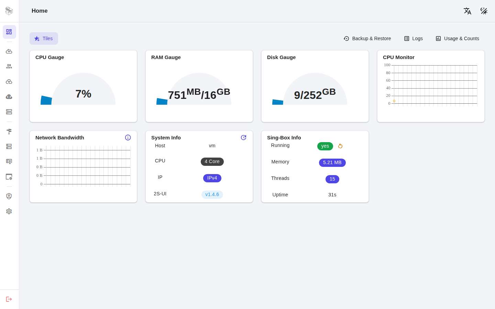

# 2S-UI
[English](README.md) · [فارسی](README.fa.md) · [Tiếng Việt](README.vi.md) · [简体中文](README.zh-CN.md) · [繁體中文](README.zh-TW.md) · [Русский](README.ru.md)

**Một bảng điều khiển web sing-box được duy trì tích cực để quản lý proxy đa giao thức, phân phối subscription, giám sát lưu lượng và triển khai tự lưu trữ.**


[](https://github.com/shenaba/2s-ui/actions/workflows/docker.yml)
[](https://goreportcard.com/report/github.com/shenaba/2s-ui)
[](https://github.com/shenaba/2s-ui/releases)
[](https://www.gnu.org/licenses/gpl-3.0.en.html)

> **Tuyên bố miễn trừ trách nhiệm:** Dự án này chỉ dành cho mục đích học tập và trao đổi cá nhân, vui lòng không sử dụng cho các mục đích bất hợp pháp, vui lòng không sử dụng trong môi trường production

**Nếu bạn thấy dự án này hữu ích, bạn có thể cho một**:star2:

**Muốn đóng góp?** Xem [CONTRIBUTING.md](CONTRIBUTING.md) để biết về thiết lập phát triển, quy ước viết mã, kiểm thử và quy trình pull request.

2S-UI dựa trên [alireza0/s-ui](https://github.com/alireza0/s-ui) và được duy trì như một bản fork tiếp nối. Nó giữ nguyên định hướng của bảng điều khiển gốc đồng thời cập nhật hỗ trợ sing-box, khả năng đa giao thức, các script triển khai và các bản sửa lỗi liên tục. Cảm ơn tác giả gốc và những người đóng góp.

## Tổng quan nhanh
| Tính năng                              |       Bật?         |
| -------------------------------------- | :----------------: |
| Đa giao thức                           | :heavy_check_mark: |
| Đa ngôn ngữ                            | :heavy_check_mark: |
| Đa client/inbound                      | :heavy_check_mark: |
| Giao diện định tuyến lưu lượng nâng cao | :heavy_check_mark: |
| Trạng thái client, lưu lượng và hệ thống | :heavy_check_mark: |
| Liên kết subscription (link/json/clash + info)| :heavy_check_mark: |
| **HTTPS tự động (ACME / Let's Encrypt)** ✨ | :heavy_check_mark: |
| Giao diện sáng/tối                      | :heavy_check_mark: |
| Giao diện API                          | :heavy_check_mark: |

## Nền tảng được hỗ trợ
| Nền tảng | Kiến trúc | Trạng thái |
|----------|--------------|---------|
| Linux    | amd64, arm64, armv7, armv6, armv5, 386, s390x | ✅ Được hỗ trợ |
| Windows  | amd64, 386, arm64 | ✅ Được hỗ trợ |
| macOS    | amd64, arm64 | 🚧 Thử nghiệm |

## Ảnh chụp màn hình




## Tài liệu API

[Wiki Tài liệu API](https://github.com/shenaba/2s-ui/wiki/API-Documentation)

## Thông tin cài đặt mặc định
- Cổng bảng điều khiển: 2095
- Đường dẫn bảng điều khiển: /app/
- Cổng subscription: 2096
- Đường dẫn subscription: /sub/
- Người dùng/Mật khẩu: admin

## Cài đặt và nâng cấp lên phiên bản mới nhất

### Linux/macOS
```sh
bash <(curl -Ls https://raw.githubusercontent.com/shenaba/2s-ui/main/install.sh)
```

### Windows
1. Tải bản phát hành Windows mới nhất từ [GitHub Releases](https://github.com/shenaba/2s-ui/releases/latest)
2. Giải nén tệp ZIP
3. Chạy `install-windows.bat` với quyền Administrator
4. Làm theo trình hướng dẫn cài đặt

## Cài đặt phiên bản cũ

**Bước 1:** Để cài đặt phiên bản cũ mà bạn mong muốn, thêm số phiên bản vào cuối lệnh cài đặt. Ví dụ, phiên bản `1.0.0`:

```sh
VERSION=1.0.0 && bash <(curl -Ls https://raw.githubusercontent.com/shenaba/2s-ui/$VERSION/install.sh) $VERSION
```

## Cài đặt thủ công

### Linux/macOS
1. Lấy phiên bản 2S-UI mới nhất phù hợp với hệ điều hành/kiến trúc của bạn từ GitHub: [https://github.com/shenaba/2s-ui/releases/latest](https://github.com/shenaba/2s-ui/releases/latest)
2. **TÙY CHỌN** Lấy phiên bản mới nhất của `s-ui.sh` [https://raw.githubusercontent.com/shenaba/2s-ui/main/s-ui.sh](https://raw.githubusercontent.com/shenaba/2s-ui/main/s-ui.sh)
3. **TÙY CHỌN** Sao chép `s-ui.sh` vào `/usr/bin/s-ui` và chạy `chmod +x /usr/bin/s-ui`.
4. Giải nén tệp s-ui tar.gz vào một thư mục tùy chọn và di chuyển đến thư mục nơi bạn đã giải nén tệp tar.gz.
5. Sao chép các tệp *.service vào /etc/systemd/system/ và chạy `systemctl daemon-reload`.
6. Bật tự động khởi động và khởi động dịch vụ 2S-UI bằng `systemctl enable s-ui --now`
7. Khởi động dịch vụ sing-box bằng `systemctl enable sing-box --now`

### Windows
1. Lấy phiên bản Windows mới nhất từ GitHub: [https://github.com/shenaba/2s-ui/releases/latest](https://github.com/shenaba/2s-ui/releases/latest)
2. Tải gói Windows phù hợp (ví dụ: `s-ui-windows-amd64.zip`)
3. Giải nén tệp ZIP vào một thư mục tùy chọn
4. Chạy `install-windows.bat` với quyền Administrator
5. Làm theo trình hướng dẫn cài đặt
6. Truy cập bảng điều khiển tại http://localhost:2095/app

## Gỡ cài đặt 2S-UI

```sh
sudo -i

systemctl disable s-ui  --now

rm -f /etc/systemd/system/sing-box.service
systemctl daemon-reload

rm -fr /usr/local/s-ui
rm /usr/bin/s-ui
```

## Cài đặt bằng Docker

<details>
   <summary>Nhấn để xem chi tiết</summary>

### Cách sử dụng

**Bước 1:** Cài đặt Docker

```shell
curl -fsSL https://get.docker.com | sh
```

**Bước 2:** Cài đặt 2S-UI

> Phương pháp Docker compose

```shell
mkdir 2s-ui && cd 2s-ui
wget -q https://raw.githubusercontent.com/shenaba/2s-ui/main/docker-compose.yml
docker compose up -d
```

> Sử dụng docker

```shell
mkdir 2s-ui && cd 2s-ui
docker run -itd \
    -p 2095:2095 -p 2096:2096 -p 443:443 \
    -v $PWD/db/:/app/db/ \
    -v $PWD/cert/:/root/cert/ \
    --name s-ui --restart=unless-stopped \
    ghcr.io/shenaba/2s-ui:latest
```

> Tự xây dựng image của riêng bạn

```shell
git clone https://github.com/shenaba/2s-ui
docker build -t 2s-ui .
```

</details>

## Chạy thủ công ( đóng góp )

<details>
   <summary>Nhấn để xem chi tiết</summary>

### Xây dựng và chạy toàn bộ dự án
```shell
./runSUI.sh
```

### Sao chép repository
```shell
# sao chép repository
git clone https://github.com/shenaba/2s-ui
```


### - Frontend

Mã frontend nằm trong thư mục `frontend/` của kho lưu trữ này

### - Backend
> Vui lòng xây dựng frontend một lần trước!

Để xây dựng backend:
```shell
# xóa các tệp frontend đã biên dịch cũ
rm -fr web/html/*
# áp dụng các tệp frontend đã biên dịch mới
cp -R frontend/dist/ web/html/
# xây dựng
go build -o sui main.go
```

Để chạy backend (từ thư mục gốc của repository):
```shell
./sui
```

</details>

## Ngôn ngữ

- Tiếng Anh
- Tiếng Ba Tư
- Tiếng Việt
- Tiếng Trung (Giản thể)
- Tiếng Trung (Phồn thể)
- Tiếng Nga

## Tính năng

- Các giao thức được hỗ trợ:
  - Chung:  Mixed, SOCKS, HTTP, HTTPS, Direct, Redirect, TProxy
  - Dựa trên V2Ray: VLESS, VMess, Trojan, Shadowsocks
  - Các giao thức khác: ShadowTLS, Hysteria, Hysteria2, Naive, TUIC
- Hỗ trợ các giao thức XTLS
- Giao diện nâng cao để định tuyến lưu lượng, tích hợp PROXY Protocol, External và Transparent Proxy, SSL Certificate và Port
- Giao diện nâng cao để cấu hình inbound và outbound
- Giới hạn lưu lượng và ngày hết hạn của client
- Hiển thị client đang trực tuyến, inbound và outbound với thống kê lưu lượng, và giám sát trạng thái hệ thống
- Dịch vụ subscription với khả năng thêm liên kết và subscription bên ngoài
- HTTPS để truy cập an toàn vào bảng điều khiển web và dịch vụ subscription (tên miền tự cung cấp + chứng chỉ SSL)
- **Chứng chỉ SSL tự động** — chỉ cần nhập tên miền và 2S-UI sẽ cấp phát và tự động gia hạn chứng chỉ Let's Encrypt miễn phí cho bạn (không cần certbot, không cần cron job)
- Giao diện sáng/tối

## Biến môi trường

<details>
  <summary>Nhấn để xem chi tiết</summary>

### Cách sử dụng

| Biến           |                      Kiểu                      | Mặc định      |
| -------------- | :--------------------------------------------: | :------------ |
| SUI_LOG_LEVEL  | `"debug"` \| `"info"` \| `"warn"` \| `"error"` | `"info"`      |
| SUI_DEBUG      |                   `boolean`                    | `false`       |
| SUI_BIN_FOLDER |                    `string`                    | `"bin"`       |
| SUI_DB_FOLDER  |                    `string`                    | `"db"`        |
| SINGBOX_API    |                    `string`                    | -             |

</details>

## Chứng chỉ SSL

### 🔐 Chứng chỉ tự động (ACME / Let's Encrypt) — Khuyến nghị

Chỉ cần nhập tên miền trong **Cài đặt bảng điều khiển** (chế độ chứng chỉ → **ACME**) và
2S-UI sẽ tự động cấp phát và tự động gia hạn chứng chỉ Let's Encrypt miễn phí — không cần certbot,
không cần cron job. Bảng điều khiển web và dịch vụ subscription có thể được bật độc lập.
Sau khi hoàn tất, bảng điều khiển có thể truy cập tại `https://<your-domain>:2095/app`.

> Yêu cầu cổng TCP **80** có thể truy cập từ internet (HTTP-01 challenge). Để
> publish cổng 80 với Docker: bỏ ghi chú dòng `80:80` trong `docker-compose.yml`,
> hoặc thêm `-p 80:80` vào `docker run`. Chứng chỉ được lưu trữ trong `cert/` và vẫn tồn tại
> sau khi khởi động lại. Nếu tên miền/cổng được cấu hình sai, 2S-UI sẽ chuyển về HTTP.

<details>
  <summary>Bạn muốn tự quản lý chứng chỉ? (Certbot)</summary>

### Certbot

```bash
snap install core; snap refresh core
snap install --classic certbot
ln -s /snap/bin/certbot /usr/bin/certbot

certbot certonly --standalone --register-unsafely-without-email --non-interactive --agree-tos -d <Your Domain Name>
```

</details>

## Số lượng Stargazers theo thời gian
[](https://starchart.cc/shenaba/2s-ui)
